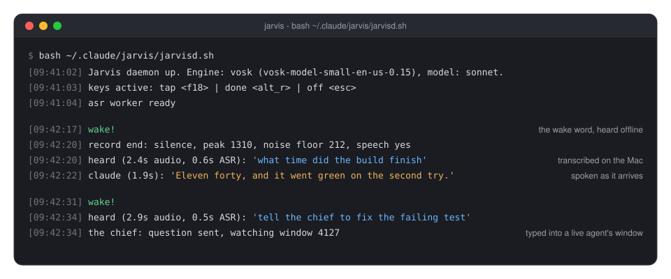
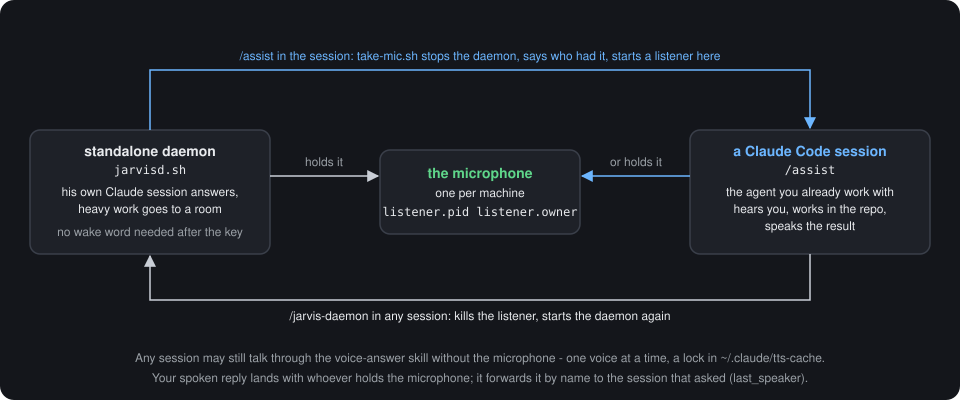

# Jarvis

Say "Jarvis" anywhere in the room, and your Mac answers out loud - in a calm
British voice, with Claude behind it. Ask what time the build finished and he
tells you. Say "tell the chief to fix the failing test" and the words land in a
live Claude Code session that goes and does it, then reports back, out loud,
while you are still making coffee.

Not a demo. This is the assistant one developer has talked to every working day
since August 2026, packed up so you can have him too.

**Nothing you say leaves the machine.** Hearing the wake word, turning speech
into text, turning the answer into a voice - all of it runs locally on Apple
silicon, no cloud speech service, no audio uploaded anywhere. The only thing
that goes out is the text of your question, to the same `claude` CLI you
already use.

**He knows your voice.** Six minutes of enrolment and he answers you and only
you. A colleague leaning into your microphone gets a polite "sorry, I only talk
to the owner of this computer". Do not want that? Skip it - it is off until you
turn it on.

**He is not a toy on the side of your work - he is inside it.** Type `/assist`
in any Claude Code session and that session takes the microphone: you talk, the
agent works in your repository and speaks the result. Any agent can report out
loud, or send you a voice message on Telegram when you have left the desk.

**One key beats every recognizer.** A spare key on your keyboard means "switch
to me": it ends your sentence, interrupts him mid-word, or wakes him with no
wake word at all.

**It grows without a fork.** New places to send a phrase and new commands to
run are rows in two TOML files. Long-term memory is any vector store you can
call from a shell script. Two languages ship; a third is one more file.

Free models, no accounts, about 800 MB of disk, MIT. Below: how one exchange
works, how to install him in fifteen minutes, and everything else.



*What the daemon prints while this happens. Log lines are the real format;
the timings are typical for an M-series Mac.*

| asleep | listening | thinking | speaking |
|---|---|---|---|
|  |  |  |  |

*The badge (`overlay.sh`) floats above every window and tells you what he is
doing and which session holds the microphone - here, one named `agent`. It
folds into a ring when idle and can be dragged anywhere.*

## One exchange, end to end

1. The wake engine listens to the microphone at 16 kHz. By default that is Vosk,
   a 40 MB offline recognizer that triggers on the real word "Jarvis" - free, no
   registration, no network.
2. A chime, then he records until you stop talking - or until you press the key,
   which ends the recording immediately.
3. `parakeet-mlx` transcribes locally. A leading wake word is stripped, so
   "Jarvis, what time is it" arrives as "what time is it".
4. `claude -p` answers inside one resumable session, and the reply is spoken by a
   local voice - piper for English, vosk-tts for Russian.
5. For a second and a half after the reply he keeps listening without a wake
   word, so a follow-up question needs no ceremony.


*The dashed box is your Mac. Two amber arrows are the only thing that leaves
it: the question as text, and the answer as text.*

## Install

Fifteen minutes, most of it downloads. Four steps, then a check.

### Before you start

You need a Mac with Apple silicon (M1 or later) running a recent macOS. Intel
Macs are out: the transcriber runs on MLX, which is Apple silicon only.

Three tools have to be on the machine already. Check each one in a terminal;
every command should print a version, not "command not found".

```bash
brew --version      # Homebrew            - https://brew.sh
uv --version        # uv, a Python runner - brew install uv
claude --version    # Claude Code CLI     - https://claude.com/claude-code
```

`claude` has to be logged in as well: run `claude` once by hand, and if it asks
you to sign in, do that first.

Two more things are optional:

- `ffmpeg` (`brew install ffmpeg`) - only for two extras: the network voice that
  fills in when a local model is missing, and Telegram voice messages. Without it
  the offline voices work as usual.
- Python. You do not install one. Every script here declares its own
  dependencies in a header, `uv` reads that header and fetches a Python 3.12 plus
  the packages on the first run. The Python that ships with macOS (3.9) is never
  used.

Expect about 800 MB of disk for the models, and an internet connection for the
one-time downloads.

### Step 1 - get the code

```bash
git clone https://github.com/spanderok/jarvis ~/.claude/jarvis
cd ~/.claude/jarvis
```

That exact folder matters: the scripts, the skills and the Claude commands all
refer to `~/.claude/jarvis`. If you would rather keep the repository somewhere
else, clone it there and run the installer from there - it puts a symlink at
`~/.claude/jarvis` pointing to your folder, and everything works the same.

### Step 2 - run the installer

```bash
bash install.sh
```

It is safe to re-run: every step skips what is already in place. In order, it

1. checks that this is a Mac and that `uv` is there, and warns if `claude` is not
   on PATH;
2. reads the language from `jarvis.env` (English if the file does not exist yet)
   and loads the locale - on the very first `uv` call this pulls a Python and
   takes about a minute;
3. links `~/.claude/jarvis` if the repo lives elsewhere;
4. links the two skills (`voice-answer`, `spotify`) into `~/.claude/skills` and
   the three commands (`/assist`, `/assist-off`, `/jarvis-daemon`) into
   `~/.claude/commands`, so any Claude Code session can use them;
5. creates `jarvis.env` from `jarvis.env.example` - your personal settings file;
6. downloads the models for your language into `models/` (see the table below);
7. installs the login item for the key remap, but only if you configured one -
   see [The key](#the-key).

It ends with a "next" block telling you which permissions to grant. A line that
starts with `warning:` is not fatal - read it, it says what will be missing.

**The models it fetches for English:**

| Model | For | Size | From |
|---|---|---|---|
| `vosk-model-small-en-us-0.15` | hearing the wake word | 41 MB | [alphacephei.com](https://alphacephei.com/vosk/models) |
| `en_GB-alan-medium` | his voice (piper) | 63 MB | [piper-voices](https://huggingface.co/rhasspy/piper-voices) |
| `campplus.onnx` | telling your voice from a stranger's | 28 MB | [CAM++ ONNX](https://huggingface.co/FunAudioLLM/CosyVoice-300M) |
| `parakeet-tdt-0.6b-v3` | transcribing the question | 600 MB | [Hugging Face](https://huggingface.co/mlx-community/parakeet-tdt-0.6b-v3) - **on the first question**, not by the installer |

Nothing is bundled and `models/` is in `.gitignore`. All of them are free and
need no account. The speaker model is the only optional one: skip it with
`JARVIS_NO_SPEAKER=1 bash install.sh` and the voice lock stays off, which is the
default anyway until you record a profile.

### Step 3 - two permissions in System Settings

Both are granted to the **terminal app you start Jarvis from** - Terminal.app,
iTerm2, Warp, whichever one it is. Not to `uv`, not to `python`.

1. **Microphone** - required. System Settings -> Privacy & Security ->
   Microphone -> turn on your terminal. macOS usually asks by itself the first
   time the daemon opens the microphone; if that dialog never appeared, add the
   app here by hand.
2. **Input Monitoring** - optional, only for the hotkeys. System Settings ->
   Privacy & Security -> Input Monitoring -> turn on your terminal. Without it
   everything works except the key; there is a way to have the key with no
   permission at all, see [The key](#the-key).

After changing either one, quit the terminal app completely and open it again -
macOS applies these on launch.

### Step 4 - start him and say his name

```bash
bash ~/.claude/jarvis/jarvisd.sh
```

The first start is slow: `uv` builds the environments for the daemon and its
workers (a couple of minutes), then the log shows

```
Jarvis daemon up. Engine: vosk (vosk-model-small-en-us-0.15) ...
asr worker ready
```

and a short click says he is listening. Say "Jarvis". A chime, then ask
something: "what is two times two". **The first question takes a while** - the
600 MB transcriber is downloaded at that moment and nothing else. From the
second question on, an answer takes a few seconds.

`Ctrl+C` stops him. To run him in the background instead, from any Claude Code
session type `/jarvis-daemon`.

### Check that everything is in place

Each of these takes seconds and tells you which part is off, if any.

```bash
cd ~/.claude/jarvis
uv run lang.py                          # the language, the wake word and the voices it picked
bash say.sh "Hello, I am up."           # you hear the local voice
uv run jarvis_daemon.py --selfcheck     # wake engine, routing examples, rooms, keys
uv run mic_check.py                     # talk; numbers above zero mean the mic reaches this terminal
```

`--selfcheck` should print `selfcheck ok, engine: vosk ...` and `routing: 8/8 ok`.
A line like `room 'chief' ... no window found` is normal - rooms are companion
sessions you have not started (see [Rooms and actions](#rooms-and-actions)).

### Make him yours

Everything personal lives in `jarvis.env`, one shell assignment per line.
`jarvis.env.example` documents every knob with its default; set only what you
change, then restart the daemon.

```sh
JARVIS_OWNER=Ada           # empty: he says "the owner of this computer"
JARVIS_MODEL=sonnet        # the Claude model for voice answers; haiku is fastest
```

The key is worth setting next - see the section below.

### If something is off

| What you see | What it means | What to do |
|---|---|---|
| `uv is missing` | the installer stopped before doing anything | `brew install uv`, run `bash install.sh` again |
| `warning: the claude CLI is not on PATH` | he will listen but cannot answer | install Claude Code, run `claude` once to log in |
| `Vosk model not found: .../models/...` | the wake model is not there | `bash install.sh models` |
| the daemon is up, you talk, nothing happens | the microphone does not reach the terminal | `uv run mic_check.py`; grant Microphone to the terminal app, restart it |
| `grant Input Monitoring to your terminal` in the log | the key listener could not start | grant it, or use `jarvis-key.sh` from Shortcuts - the rest works without it |
| he answers with a network voice or a robotic system voice | the local voice model is missing | `bash install.sh models`; the log names the missing file |
| the first answer takes a minute or more | the 600 MB transcriber is downloading | wait it out once |
| every start is slow | `uv` rebuilding environments | normal only on the first start; check disk space if it repeats |
| `piper: Error processing file ... espeak-ng-data` | the path to uv's cache is longer than espeak-ng can handle (about 240 characters) | keep the repository and your home folder at ordinary depths |

The daemon writes what it hears and does to `listener.log`; `bash why.sh` shows
the last sixty lines.

### Russian

Set the language **before** the models are downloaded, because the language
decides which models those are:

```bash
cd ~/.claude/jarvis
cp jarvis.env.example jarvis.env
echo 'JARVIS_LANG=ru' >> jarvis.env
bash install.sh
```

For Russian the installer fetches the Russian wake recognizer (46 MB), the
vosk-tts voice with its stress dictionary (135 MB) and creates a small Python
environment `venv-vosk` for it - vosk-tts does not fit the one-file header the
other scripts use. The transcriber is the same multilingual model.

Already installed in English and want to switch? Add `JARVIS_LANG=ru` to
`jarvis.env`, run `bash install.sh models`, restart the daemon. Both sets of
models can sit side by side.

### Updating

```bash
cd ~/.claude/jarvis && git pull && bash install.sh
```

`jarvis.env`, your voice print, your rooms and actions in `rooms.d/` and
`actions.d/` are all ignored by git, so a pull never touches them. The installer
only adds what is new.

### Uninstall

```bash
bash ~/.claude/jarvis/keymap.sh off                          # if you set up a key remap
launchctl unload ~/Library/LaunchAgents/com.jarvis.keymap.plist 2>/dev/null
rm -f ~/Library/LaunchAgents/com.jarvis.keymap.plist
rm -f ~/.claude/skills/voice-answer ~/.claude/skills/spotify
rm -f ~/.claude/commands/assist.md ~/.claude/commands/assist-off.md ~/.claude/commands/jarvis-daemon.md
rm -rf ~/.claude/jarvis ~/.claude/tts-cache
```

Then remove the terminal app from Microphone and Input Monitoring in System
Settings if you no longer want it there. The Python environments live in
`~/.cache/uv` and go away with `uv cache clean`.

## The voice lock - he answers only you

A microphone hears everyone in the room. The voice lock is how he tells your
voice from a colleague's, a visitor's, or his own coming back through the
speakers - and it is **off until you record a profile**. Without one he answers
whoever speaks, and nothing else changes.

### How it decides

It compares voices, not words, so the phrase does not matter.

1. The recorded phrase goes through `campplus.onnx`, a small speaker model,
   which folds it into one vector of 512 numbers - the voice print of whoever
   just spoke.
2. That print is compared with two crowds: every take you recorded at
   enrolment, and a cohort of voices that are not you - his own synthesised
   speech and two macOS system voices, which he gathers from disk himself.
3. Two numbers come out, "how much this looks like you" and "how much it looks
   like somebody else", and you have to win by a margin. The margin is
   measured at enrolment, not guessed.

Why two numbers and not one threshold, measured on a real profile: his own
synthesised voice, coming back through the speakers, scored 0.65 against the
owner's takes - higher than the owner's own tired take at 0.57. No single line
separates those. But the same synthesised clip scores 0.95 against other clips
of itself, so "looks like you minus looks like the cohort" lands at -0.31 for
it and at +0.10 or better for every take of the owner's. The tired voice gets
through; the speakers do not.

Everything **fails open**. No model, no profile, a broken file, a phrase under
one second - he lets it through. A lock that silences him because a file went
missing would be worse than no lock.

Three cases skip the check on purpose, because there is better evidence than a
voice:

- a take you started or ended with the key - that is your own hand on the
  keyboard;
- a take with music still playing in it - the print is then you and a song at
  once, and matches nobody;
- the follow-up window after his answer still checks, but refuses silently -
  nobody asked for that take.

### Recording your profile

Stop the daemon first (`Ctrl+C`, or `/assist-off`) - the script warns if he is
still listening, because he would hear the enrolment as questions. Then:

```bash
uv run ~/.claude/jarvis/enroll_voice.py
```

It records six takes of six seconds each. Before each one it prints how to
speak and what to say - the phrases come from your locale, so they are real
commands in your language, not test sentences:

```
[normal] Your ordinary voice, sitting at the Mac as usual.
    phrase: "Jarvis, what is on the list for today, have a look please"
    Enter, then talk:
    recorded, level 812
    keep it? [Y/n]
[close] Closer to the microphone, a little quieter than usual.
...
[far] Step two or three metres away and speak up.
[noise] Put music or a fan on and talk over it.
[tired] Quiet, tired, a little hoarse - the way you sound late at night.
[fast] Fast and careless, swallowing the ends of words.
```

Several takes rather than one average, because a microphone hears a tired
voice at arm's length differently from a fresh one leaning in; a single
average sits between the two and matches neither. Each take is kept whole, and
a phrase is yours if it matches any one of them.

At the end it works out where the line goes, prints the numbers, and says
either `Room between you and the cohort: ... - that is enough` or
`!! The gap is small` - the latter means one take sounded forced, re-record
that one with `--add <name>`. For scale, `--report` on a real profile after a
few weeks of use, thirteen takes against fifty-six other voices:

```
takes: 13 - normal, close, far, noise, tired, fast, fresh, aircon, ...
cohort voices: 56
recognition floor: 0.45, margin line: -0.14
worst own take: 0.65, its smallest gap: +0.11, cohort's best gap: -0.31 (jarvis-tts)
```

The profile is `voiceprint.json`. It is biometric data and is in `.gitignore`
along with the recordings; it never leaves the machine.

Restart the daemon. From now on a stranger hears the refusal line once, and for
the next sixty seconds further strangers are dropped without a word, so a
conversation next to your desk does not get a running commentary.

### Living with it

```bash
uv run enroll_voice.py --check          # say something, see the score and the verdict
uv run enroll_voice.py --report         # what the profile holds
uv run enroll_voice.py --forgive        # replay what he refused, add the ones that were you
uv run enroll_voice.py --add whisper    # one more condition, any name you like
uv run enroll_voice.py --rebuild        # redo the maths, keep the takes
```

`--forgive` is the one you will use. Every refused phrase is saved in
`rejected/`; it plays them back one at a time and asks "was that you?". A yes
adds the take to the profile and moves the line.

Changed the microphone, or the room? Either re-record, or switch the check off
until you do:

```sh
JARVIS_SPK=off                          # in jarvis.env: never check who is talking
JARVIS_STRANGER_LINE="Not for you."     # what he says to someone who is not you
```

Voice messages from Telegram go through the same check, so a stranger with
your phone gets the same refusal.

### Living without it

Do nothing - that is the default. Two ways to make the choice explicit:

- `JARVIS_NO_SPEAKER=1 bash install.sh` skips the 28 MB model download, and
  the check has nothing to run on;
- `JARVIS_SPK=off` in `jarvis.env` keeps the model and the profile but never
  consults them.

Without the lock the key is still your protection: a stranger can ask him
questions, but handing work to another agent needs the key by default, and he
says so out loud if someone tries by voice alone.

## The key

Speech recognition guesses; a key press does not. One press is your own hand
saying "switch to me", and it means something different depending on what he is
doing:

| While he is | One press | Two presses |
|---|---|---|
| listening to you | that was the whole question, answer now | forget it, back to the wake word |
| thinking or talking | interrupt, and listen to what I say next | shut up and wait |
| idle | wake up, no wake word needed | nothing |

Three ways to get that key, pick one.

**1. A spare key on your keyboard.** A macro key that sends `End` becomes F18,
and F18 is the Jarvis key. F18 because F13 is Print Screen on a Mac and
applications do react to it - a macro key mapped to F13 once wiped a cell in a
spreadsheet. F16..F20 have no system meaning and nothing binds them.

```bash
bash keymap.sh list        # find your keyboard's VendorID and ProductID
```

Put them into `jarvis.env`:

```sh
JARVIS_KEYMAP_VENDOR=1234
JARVIS_KEYMAP_PRODUCT=567
JARVIS_KEYMAP_SRC=0x4D     # the key you press: End
JARVIS_KEYMAP_DST=0x6D     # what it becomes: F18
```

```bash
bash keymap.sh on          # apply now
bash install.sh keymap     # and re-apply at every login
bash keymap.sh off         # undo
```

The remap is scoped to that one keyboard, so `End` keeps working everywhere else.

**2. Any key you already have.** No remapping needed - just tell the daemon which
key to watch:

```bash
uv run probe_key.py        # press the key, it prints the name to use
```

```sh
JARVIS_TAP_KEYS="<f13>"    # switch to me
JARVIS_DONE_KEYS="<alt_r>" # "answer now", only while he is listening
JARVIS_OFF_KEYS="<esc>"    # shut up and wait
```

The defaults are the right Option key and Escape. The daemon does not swallow
key presses, so a "done" key that prints a character - space was tried - also
types that character into whatever window is in front. Right Option prints
nothing and no application binds it alone; Escape only acts while he is busy, so
pressing it in an editor never touches him.

**3. No key at all.** If you would rather not grant Input Monitoring, bind
`jarvis-key.sh` to a keyboard shortcut in Shortcuts.app (Run Shell Script). It
signals the running daemon and needs no permission whatsoever:

```bash
jarvis-key.sh              # one press
jarvis-key.sh double       # two presses
```

The same thing by hand: `kill -USR1 <pid>` and `kill -USR2 <pid>`.

## Settings

Everything personal lives in `jarvis.env` - your name, the keys, timings, which
model answers. `jarvis.env.example` documents every knob with its default; copy,
edit, restart. The code ships unchanged.

## Two ways to run him

**Standalone daemon** - `jarvisd.sh`. His own Claude session answers, and heavy
work is handed to another window.

**Inside an agent session** - the `/assist` command. The session you are already
working in takes the microphone and starts hearing you: you ask out loud, the
agent does the work in that repository and answers out loud. `/assist-off` gives
the microphone back, `/jarvis-daemon` returns it to the standalone daemon.

There is one microphone, so only one of them can hold it. Both drop in through
the same file lock, and each tells you who it took it from.



*Who holds the microphone, and the two commands that move it. Any session can
still speak through the voice-answer skill; your spoken reply always lands with
the holder, which forwards it by name.*

## Rooms and actions

He answers most questions himself. The rest either go to a **room** - another
Claude session in a Terminal window - or set off an **action**, a command that
runs here and whose output he reads out.

Say "tell the chief to ship the demo" and the task is typed into the window of
the session named `chief`, where you can watch it work. Say "what's playing" and
nothing leaves the machine: a script runs and he names the track.

Neither is built in. Both are rows in two TOML files:

```toml
# rooms.d/notes.toml
[[room]]
id = "notes"
label = "notes"
session = "notes"
work_dir = "~/notes"
launch = "room.sh notes"
ask = ["ask notes", "ask my notes"]
tell = ["write this down"]
ack_ask = "Asked your notes."
```

`bash room.sh notes` raises it and he can address it. Nothing else was edited -
not the daemon, not the launcher, not his system prompt, which picks up the
room's own `hint` line.


*The routes, in the order they are tried. First match wins; an order always
outranks an automatic route, so "tell the chief what's playing" goes to the
chief, not to Spotify.*

Out of the box `config/rooms.toml` declares one room, `chief`, a working agent
started in `~/projects` - change `work_dir` to your own folder, or override it
without editing the file with `JARVIS_ROOM_CHIEF_DIR=~/code` in `jarvis.env`.
Raise it with `bash room.sh chief`; until then "tell the chief" gets "No window
for the chief". A second room, `chat`, ships switched off.

**[docs/EXTENDING.md](docs/EXTENDING.md)** walks one question end to end, gives
the order the routes are tried in, and explains the one field that will steal
your ordinary questions if you set it carelessly.

## Long-term memory

His session forgets everything ten minutes after the last question. Point him at
a vector store and he stops forgetting:

```toml
# config/memory.toml
[memory]
enabled = true
recall = "memory.d/recall.sh"      # the question in, context out
remember = "memory.d/remember.sh"  # the question and the answer in
timeout_s = 3.0
```

`recall` is any command that takes a question as its argument and prints plain
text. That text goes in front of the question before Jarvis is asked:

```
you say         "what did we decide about the deploys"
recall runs     memory.d/recall.sh "what did we decide about the deploys"
it prints       Decided 12 Aug: deploys go out Tuesdays, one person on call.
he answers      "Tuesdays, with one person on call. That was the twelfth."
```

A command and not a library on purpose. Chroma, Qdrant, LanceDB, sqlite-vec or a
grep over a folder of markdown are all a shell script, so none of them becomes a
dependency of this repository - and a fixed route cannot be talked into reading
something it was not pointed at. `memory.d/` ships a grep example that needs
nothing installed, and a Chroma one to copy from.

Off until you switch it on, and it fails open: a store that is down costs you the
context, never the answer. Check yours with
`uv run memory.py "a question you would ask"`.

## Languages

`JARVIS_LANG=en` is the default; `JARVIS_LANG=ru` is the other one that ships.
A language is one file in `locales/`, holding everything he says and listens for:

- the wake word, and the forms a small recognizer mangles it into
- the stop words, the acknowledgements, the line for a stranger
- the persona prompt that gives him his manner
- the models that can handle it - the wake recognizer, the transcriber, the voice

The models come from the locale so that a prompt in one language cannot end up
read by a voice in another. English speaks through
[piper](https://github.com/rhasspy/piper) (63 MB a voice, offline, about 0.3 s to
first sound), Russian through vosk-tts. Any piper voice drops in:

```sh
JARVIS_VOICE=en_US-lessac-medium         # the shipped default is en_GB-alan-medium
JARVIS_EXTRA_VOICES="en_US-ryan-high"    # fetched by install.sh alongside it
```

Adding a third language is copying `locales/en.toml`. The routing vocabulary is
separate, because it belongs to your rooms rather than to the language -
`rooms.d/ru.example.toml` is a complete Russian preset showing how far a drop-in
goes.

## What else is in the box

Optional pieces, each independent - ignore what you do not need.

| Piece | What it does | Needs |
|---|---|---|
| `skills/voice-answer` | lets any Claude session speak a short answer aloud | nothing extra; `ffmpeg` for Telegram voice messages |
| `skills/spotify` | voice control for Spotify | two Keychain entries, see `skills/spotify/SKILL.md` |
| `overlay.sh` | floating badge showing listening / thinking / talking | nothing |
| `status.sh` | menu bar indicator | nothing |
| `tg_listen.py` | ask him from Telegram, by text or voice message | a bot token and your chat id in the Keychain as `jarvis-telegram-token` and `jarvis-telegram-chat` |
| `room.sh` | raise a companion session he can hand work to | a Terminal.app window |
| `enroll_voice.py` | record a voice print so he only answers you | `models/campplus.onnx` |
| `memory.py` | the vector-store hook, and a way to test it | a `recall` command of yours |
| `mic_check.py`, `probe_key.py`, `why.sh` | diagnostics when something is off | nothing |

Secrets go into the macOS Keychain, never into a file here:

```bash
security add-generic-password -U -s jarvis-telegram-token -a "$USER" -w '<bot token>'
security add-generic-password -U -s jarvis-telegram-chat  -a "$USER" -w '<your chat id>'
```

## Privacy

Everything stays on the machine, and the repository is built to keep it that way.
`.gitignore` excludes the voice print, the enrolment recordings, the logs (they
hold transcripts of everything said near the microphone), the Telegram chat id
and inbox, and the Spotify tokens. Secrets are read from the macOS Keychain, never
from a file in the repo.

The voice lock is off unless you enable it, and it fails open by design: a
missing model or a broken profile lets everyone through rather than silencing him.

## License

MIT.
