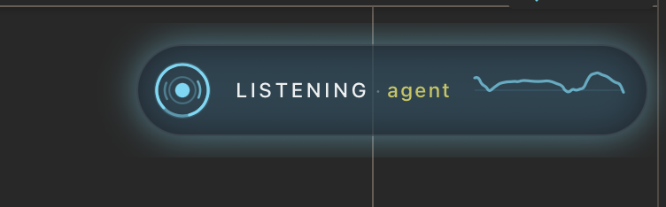
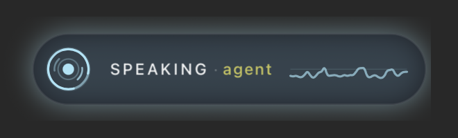
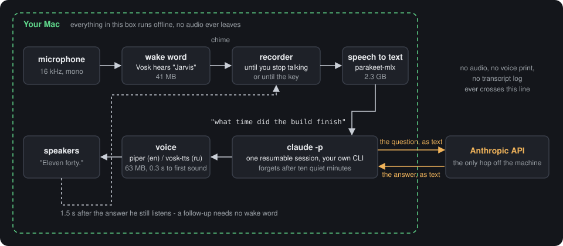
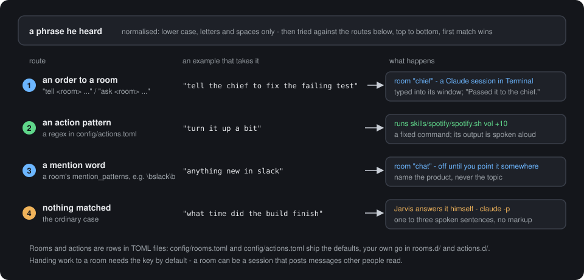

# Jarvis

**A voice for Claude Code.** Say "Jarvis" anywhere in the room and your Mac
answers out loud - and the agent you already work with does the work.
macOS on Apple silicon, everything spoken stays on the machine, MIT.


> **Free. No account, no API key, no second subscription.** The only thing you
> pay for is the Claude subscription you already have. Every speech model here
> is free and runs on your Mac - hearing, transcribing and talking cost no
> tokens at all. A spoken question costs exactly what the same question typed
> into Claude Code would, and not one token more.

| asleep | listening | thinking | speaking |
|---|---|---|---|
|  |  |  |  |

Ask what time the build finished and he tells you. Say "tell the agent to fix
the failing test" and the words land in a live Claude Code session that goes
and does it, then reports back, out loud, while you are still making coffee.

```bash
git clone https://github.com/spanderok/jarvis ~/.claude/jarvis
cd ~/.claude/jarvis && bash install.sh     # models, skills, commands - about ten minutes
# it ends by naming the permissions macOS has not given yet, and to which app
bash jarvisd.sh                            # then say "Jarvis"
```

The two permissions are granted to **the application you start him from**, which
is the one thing worth reading twice: run him from an IDE's terminal panel and
they belong to the IDE, not to Terminal.app. The Microphone is required, Input
Monitoring is what makes the key work, and `uv run perm_check.py` names both
along with the app.

That is the whole install; the [step by step](#install) below has the details
and the things that go wrong.

## What leaves your Mac, exactly

Jarvis is ears and a mouth. He has no brain, no account, no server and no data
of his own - the answer comes from the `claude` CLI that is already on your
machine, under your own login and your own terms.

| | Where it happens |
|---|---|
| hearing the wake word | your Mac, Vosk, offline |
| turning speech into text | your Mac, parakeet-mlx, offline |
| turning the answer into speech | your Mac, piper or vosk-tts, offline |
| **answering the question** | **the `claude` CLI you already use - the same place your typed questions go** |

Not one byte of audio is uploaded anywhere. What crosses the line is the text of
your question and the text of the answer, and it crosses it exactly where it
would have crossed it if you had typed the same question into Claude Code
yourself.

**So he cannot leak what you would not leak by typing.** That is worth spelling
out, because it is the first thing people worry about:

- **He reads nothing on his own.** No files, no chats, no repositories. The
  standalone daemon runs `claude -p` in an empty folder with
  `--strict-mcp-config` (no MCP servers at all) and `--allowedTools WebSearch
  WebFetch` - it is a headless session, so any tool not on that list is refused
  rather than asked about. `JARVIS_MCP=1` is how you opt in to your MCP servers,
  and `JARVIS_TOOLS` to more tools; both are off until you turn them on.
- **`/assist` adds nothing either.** It hands the words to the session you were
  already working in - the same tools, the same MCP servers, the same CLAUDE.md,
  the same permission prompts. A session told never to push to `main` will not
  push to `main` because you asked out loud. The microphone is another keyboard,
  not another set of rights.
- **Which means the policy question is about Claude Code, not about Jarvis.** If
  your workplace is fine with you using Claude Code on a repository, saying the
  same thing out loud changes nothing. If it is not, Jarvis does not make it
  fine - and adding a microphone to a session that can read your work chat is a
  decision you make when you attach that session, not one he makes for you.

Two things to know rather than assume: `listener.log` keeps a transcript of what
was heard, on your disk and in `.gitignore`; and the voice fallback for a missing
local model is Microsoft's `edge-tts`, which sends the sentence to be spoken over
the network - it never runs unless the local voice is gone, and
`JARVIS_BACKEND=system` removes even that possibility.

## Why you would want him

**He is ears and a mouth for the agent you already have.** Jarvis has no brain
of his own. Type `/assist` in any Claude Code session and that session hears
you and talks back - with every tool, MCP server and project rule it already
has. Ask "is the pipeline green" and the agent that can read your CI answers.

**Nothing you say leaves the machine.** Wake word, speech to text, text to
speech - all local, on Apple silicon. The only thing that goes out is the text
of your question, to the same `claude` CLI you already use.

**And it costs almost nothing to keep on.** Listening takes about 2 % of one
core and 120 MB. The big models wake for half a second per phrase -
[measured](#what-it-costs-your-mac).

**"Tell me out loud when you are done."** Hand an agent a long task, add that
sentence, walk away. Twenty minutes later a voice tells you how it went. This
one habit is why people keep him on -
[more of them](#in-a-working-day).

**He can know your voice - if you want.** Off by default. Six minutes of
enrolment and he answers you and only you; a colleague leaning into your
microphone gets a polite refusal.

**One key beats every recognizer, and it is the right Option key.** That is the
default, out of the box: press it and he is listening, no wake word. Press it
while he is talking and he stops mid-word and listens instead - the fastest way
to interrupt an answer that went the wrong way. It types no character and no
application binds it, so it costs nothing to leave armed. It needs Input
Monitoring; see [The key](#the-key) for the version that needs no permission
at all.

**You teach him new tricks in a config file, not in Python.** "What's playing"
running a script, "tell the reviewer" typing into a second session, memory of
last month's decisions from your own notes - each is a few lines in a settings
file. English and Russian in the box; a third language is one more text file.

*The badge above (`overlay.sh`) floats over every window and shows what he is
doing and which session holds the microphone - here, one named `agent`. Drag it
wherever it bothers you least; it remembers the spot. **A click on it is a press
of the key** - shut up and listen to me, that was my whole question, or wake up,
depending on what he is doing; twice in a row drops it entirely. The badge needs
no macOS permission, which makes it the way to reach him that always works.*

## Contents

- [What leaves your Mac, exactly](#what-leaves-your-mac-exactly)
- [One exchange, end to end](#one-exchange-end-to-end)
- [Install](#install) - [before you start](#before-you-start), [four steps](#step-1---get-the-code), [check](#check-that-everything-is-in-place), [if something is off](#if-something-is-off), [Russian](#russian), [updating](#updating), [uninstall](#uninstall)
- [Your agent's ears and mouth](#your-agents-ears-and-mouth)
- [In a working day](#in-a-working-day)
- [What it costs your Mac](#what-it-costs-your-mac)
- [The voice lock - he answers only you](#the-voice-lock---he-answers-only-you)
- [The key](#the-key)
- [When he cuts you off, or will not let you finish](#when-he-cuts-you-off-or-will-not-let-you-finish)
- [Rooms and actions](#rooms-and-actions)
- [Long-term memory](#long-term-memory)
- [Languages](#languages) - [when he says a word wrong](#when-he-says-a-word-wrong)
- [What else is in the box](#what-else-is-in-the-box)
- [Privacy](#privacy), [Disclaimer](#disclaimer), [Feedback](#feedback), [License](#license)

## One exchange, end to end

1. The wake engine listens to the microphone at 16 kHz. By default that is Vosk,
   a 40 MB offline recognizer that triggers on the real word "Jarvis" - free, no
   registration, no network.
2. A chime, then he records until you stop talking - or until you press the key,
   which ends the recording immediately.
3. `parakeet-mlx` transcribes locally. A leading wake word is stripped, so
   "Jarvis, what time is it" arrives as "what time is it".
4. `claude -p` answers inside one resumable session, and the reply is spoken by a
   local voice - piper for English, vosk-tts for Russian.
5. For a second and a half after the reply he keeps listening without a wake
   word, so a follow-up question needs no ceremony.



*The dashed box is your Mac. Two amber arrows are the only thing that leaves
it: the question as text, and the answer as text.*

## Install

Fifteen minutes, most of it downloads. Two ways to spend them.

**Let Claude do it.** Open Claude Code in any folder and paste this:

```
Install https://github.com/spanderok/jarvis on this Mac. Follow its README:
clone it to ~/.claude/jarvis, run install.sh, run the checks, and tell me
which permissions I have to grant by hand in System Settings.
```

The agent reads this page, runs the same steps as below and stops at the two
things only you can do - the Microphone and Input Monitoring toggles. That is
the point of the design: the installer is plain shell, the checks print plain
text, so an agent can drive it and read the result.

**Or do it yourself.** Four steps, then a check.

### Before you start

You need a Mac with Apple silicon (M1 or later) running a recent macOS. Intel
Macs are out: the transcriber runs on MLX, which is Apple silicon only.

Four tools have to be on the machine already. Check each one in a terminal;
every command should print a version, not "command not found".

```bash
brew --version      # Homebrew            - https://brew.sh
uv --version        # uv, a Python runner - brew install uv
claude --version    # Claude Code CLI     - https://claude.com/claude-code
ffmpeg -version     # ffmpeg              - brew install ffmpeg
```

`claude` has to be logged in as well: run `claude` once by hand, and if it asks
you to sign in, do that first.

`ffmpeg` is how the transcriber reads a recording. Without it he still hears his
name and still records the question, but every transcript comes back empty, so
nothing ever happens and the only trace is one line in the log: `!ERR FFmpeg is
not installed or not in your PATH`. It also carries the network voice that fills
in when a local model is missing, and Telegram voice messages.

One more thing, and it is not something you install:

- Python. You do not install one. Every script here declares its own
  dependencies in a header, `uv` reads that header and fetches a Python 3.12 plus
  the packages on the first run. The Python that ships with macOS (3.9) is never
  used.

Expect about 4.5 GB of disk and an internet connection for the one-time
downloads. Measured on a clean install: 155 MB of models in the repository,
2.3 GB for the transcriber in `~/.cache/huggingface`, and about 2 GB of Python
environments in `~/.cache/uv`. Only the first of those three is inside the
repository folder; `uv cache clean` reclaims the third at the price of the next
start being slow again.

### Step 1 - get the code

```bash
git clone https://github.com/spanderok/jarvis ~/.claude/jarvis
cd ~/.claude/jarvis
```

That exact folder matters: the scripts, the skills and the Claude commands all
refer to `~/.claude/jarvis`. If you would rather keep the repository somewhere
else, clone it there and run the installer from there - it puts a symlink at
`~/.claude/jarvis` pointing to your folder, and everything works the same.

### Step 2 - run the installer

```bash
bash install.sh
```

It is safe to re-run: every step skips what is already in place. In order, it

1. checks that this is a Mac and that `uv` is there, and warns if `claude` is not
   on PATH;
2. reads the language from `jarvis.env` (English if the file does not exist yet)
   and loads the locale - on the very first `uv` call this pulls a Python and
   takes about a minute;
3. links `~/.claude/jarvis` if the repo lives elsewhere;
4. links the two skills (`voice-answer`, `spotify`) into `~/.claude/skills` and
   the three commands (`/assist`, `/assist-off`, `/jarvis-daemon`) into
   `~/.claude/commands`, so any Claude Code session can use them;
5. creates `jarvis.env` from `jarvis.env.example` - your personal settings file;
6. downloads the models for your language into `models/` (see the table below);
7. installs the login item for the key remap, but only if you configured one -
   see [The key](#the-key).

It ends with a "next" block telling you which permissions to grant. A line that
starts with `warning:` is not fatal - read it, it says what will be missing.

**The models it fetches for English:**

| Model | For | Size | From |
|---|---|---|---|
| `vosk-model-small-en-us-0.15` | hearing the wake word | 41 MB | [alphacephei.com](https://alphacephei.com/vosk/models) |
| `en_GB-alan-medium` | his voice (piper) | 63 MB | [piper-voices](https://huggingface.co/rhasspy/piper-voices) |
| `campplus.onnx` | telling your voice from a stranger's | 28 MB | [CAM++ ONNX](https://huggingface.co/FunAudioLLM/CosyVoice-300M) |
| `parakeet-tdt-0.6b-v3` | transcribing the question | 2.3 GB | [Hugging Face](https://huggingface.co/mlx-community/parakeet-tdt-0.6b-v3) - **when the daemon first starts**, not by the installer |

Nothing is bundled and `models/` is in `.gitignore`. All of them are free and
need no account. The speaker model is downloaded but **not used** until you
record a voice profile - see [The voice lock](#the-voice-lock---he-answers-only-you).
Skip even the download with `JARVIS_NO_SPEAKER=1 bash install.sh`.

### Step 3 - two permissions in System Settings

The installer ends by asking macOS about both and printing what is missing, by
name. You can ask again at any time:

```bash
uv run ~/.claude/jarvis/perm_check.py
```

```
permissions for WebStorm:
  microphone        granted
  input monitoring  MISSING
      System Settings -> Privacy & Security -> Input Monitoring -> add WebStorm,
      then quit it completely and open it again.
      The pane opens straight from here: open 'x-apple.systempreferences:...'
```

Both are granted to the **application you start him from**, and that is not
always the obvious one: run him from an IDE's terminal panel and the permission
belongs to the IDE, not to Terminal.app. The check walks up the process chain
and names it, so there is nothing to guess. Neither permission is granted to
`uv` or to `python`.

1. **Microphone** - required. Without it he hears nothing, and nothing says so:
   the stream opens and delivers silence. macOS usually asks by itself the first
   time the daemon opens the microphone; if that dialog never appeared, add the
   app by hand.
2. **Input Monitoring** - optional, only for the key. Without it macOS drops
   every press before it arrives, so the key looks broken rather than
   unpermitted - the daemon says so in `listener.log` instead of claiming the
   keys are live. Everything else works; there is also a way to have the key
   with no permission at all, see [The key](#the-key).

After changing either one, quit the application completely and open it again -
macOS applies these on launch.

### Step 4 - start him and say his name

```bash
bash ~/.claude/jarvis/jarvisd.sh
```

The first start is slow: `uv` builds the environments for the daemon and its
workers (a couple of minutes), then the log shows

```
Jarvis daemon up. Engine: vosk (vosk-model-small-en-us-0.15) ...
asr worker ready
```

**The first start also downloads the 2.3 GB transcriber**, in the background,
which is why `asr worker ready` can be minutes behind the line above it on a
slow connection. Nothing else waits for it: he hears his name and chimes
straight away, and a question asked before the model is here is transcribed by
a slower one-shot run. From the second question on, an answer takes a few
seconds.

A short click says he is listening. Say "Jarvis". The very first wake is the
setup one: he asks, in English, which language he should speak, and you answer
out loud - "English", "Russian", "по-русски". He saves that answer, fetches
whatever models it needs, and restarts into it. Every wake after that goes
straight to your question: say "Jarvis", wait for the chime, ask something like
"what is two times two".

`Ctrl+C` stops him. To run him in the background instead, from any Claude Code
session type `/jarvis-daemon` - and then `Ctrl+C` is gone, so the way to stop
that one is `pkill -f jarvis_daemon.py` from any terminal. Worth knowing before
the first start: the key that would otherwise quiet him needs a permission
granted in Step 3, and until it is granted he cannot be stopped by hand.

### Check that everything is in place

Each of these takes seconds and tells you which part is off, if any.

```bash
cd ~/.claude/jarvis
uv run lang.py                          # the language, the wake word and the voices it picked
bash say.sh "Hello, I am up."           # you hear the local voice
uv run perm_check.py                    # microphone and Input Monitoring, by app name
uv run jarvis_daemon.py --selfcheck     # wake engine, routing examples, rooms, keys
uv run mic_check.py                     # talk; numbers above zero mean the mic reaches this terminal
```

`--selfcheck` should print `selfcheck ok, engine: vosk ...` and `routing: 8/8 ok`.
A line like `room 'chief' ... no window found` is normal - rooms are companion
sessions you have not started (see [Rooms and actions](#rooms-and-actions)).

### Make him yours

Everything personal lives in `jarvis.env`, one shell assignment per line -
your name, the keys, timings, which model answers, the language.
`jarvis.env.example` documents every knob with its default; set only what you
change, then restart the daemon. The code itself ships unchanged.

```sh
JARVIS_OWNER=Ada           # empty: he says "the owner of this computer"
JARVIS_MODEL=sonnet        # the Claude model for voice answers; haiku is fastest
```

The key is worth setting next - see [The key](#the-key).

### If something is off

| What you see | What it means | What to do |
|---|---|---|
| `uv is missing` | the installer stopped before doing anything | `brew install uv`, run `bash install.sh` again |
| `warning: the claude CLI is not on PATH` | he will listen but cannot answer | install Claude Code, run `claude` once to log in |
| `ffmpeg is missing` from the installer, or `!ERR FFmpeg is not installed or not in your PATH` in the log | the transcriber cannot read the recording, so every question comes back empty and no answer is ever attempted | `brew install ffmpeg`, then start him again |
| `Vosk model not found: .../models/...` | the wake model is not there | `bash install.sh models` |
| the daemon is up, you talk, nothing happens | the microphone does not reach the terminal | `uv run mic_check.py`; grant Microphone to the terminal app, restart it |
| the badge never appears | it is started by `jarvisd.sh` and by `/assist`, and nothing else | `bash overlay.sh` raises it by hand; `JARVIS_OVERLAY=0` is what turns it off |
| `keys are dead: <app> has no Input Monitoring` in the log | macOS drops every key press before he sees it | `uv run perm_check.py` prints the link to the right pane; or use `jarvis-key.sh` from Shortcuts, which needs no permission |
| he is listening, the key does nothing, and you want him to stop now | the key is the usual way out and it is the one thing a missing permission takes away | click the badge twice - the same as two presses, he drops everything; from a terminal, `bash ~/.claude/jarvis/jarvis-key.sh double` does it too and `pkill -f jarvis_daemon.py` shuts him down - none of the three needs any permission |
| `keymap skipped` or `keymap failed` in the log | no keyboard was remapped - none is configured, or the configured one is unplugged | normal unless you wanted a remapped key; `bash keymap.sh list`, then fill in `jarvis.env` |
| he answers with a network voice or a robotic system voice | the local voice failed - a missing model, or the espeak-ng error in the row below | `bash install.sh models`; if the models are there, run `bash say.sh test` by hand and read what piper prints |
| the first answer takes a minute or more | the 2.3 GB transcriber is downloading | wait it out once |
| every start is slow | `uv` rebuilding environments | normal only on the first start; check disk space if it repeats |
| `piper: Error processing file ... espeak-ng-data` | the path to uv's cache is longer than espeak-ng can handle (about 240 characters) | keep the repository and your home folder at ordinary depths |

The daemon writes what it hears and does to `listener.log`; `bash why.sh` shows
the last sixty lines.

### Russian

Set the language **before** the models are downloaded, because the language
decides which models those are:

```bash
cd ~/.claude/jarvis
cp jarvis.env.example jarvis.env
echo 'JARVIS_LANG=ru' >> jarvis.env
bash install.sh
```

For Russian the installer fetches the Russian wake recognizer (46 MB), the
vosk-tts voice with its stress dictionary (135 MB) and creates a small Python
environment `venv-vosk` for it - vosk-tts does not fit the one-file header the
other scripts use. The transcriber is the same multilingual model.

Already installed in English and want to switch? Add `JARVIS_LANG=ru` to
`jarvis.env`, run `bash install.sh models`, restart the daemon. Both sets of
models can sit side by side.

### Updating

```bash
cd ~/.claude/jarvis && git pull && bash install.sh
```

`jarvis.env`, your voice print, your rooms and actions in `rooms.d/` and
`actions.d/` are all ignored by git, so a pull never touches them. The installer
only adds what is new.

### Uninstall

```bash
bash ~/.claude/jarvis/keymap.sh off                          # if you set up a key remap
launchctl unload ~/Library/LaunchAgents/com.jarvis.keymap.plist 2>/dev/null
rm -f ~/Library/LaunchAgents/com.jarvis.keymap.plist
rm -f ~/.claude/skills/voice-answer ~/.claude/skills/spotify
rm -f ~/.claude/commands/assist.md ~/.claude/commands/assist-off.md ~/.claude/commands/jarvis-daemon.md
rm -rf ~/.claude/jarvis ~/.claude/tts-cache
```

Then remove the terminal app from Microphone and Input Monitoring in System
Settings if you no longer want it there. The Python environments live in
`~/.cache/uv` and go away with `uv cache clean`.

## Your agent's ears and mouth

Jarvis does not think. He hears, he speaks, and he hands the words to a Claude
Code session - so what he *can do* is exactly what that session can do.

Run one exchange through `/assist` to see what that means. You type `/assist`
in the session where you are working on a repository with a Jira MCP server
configured. You say "Jarvis, what is left in the sprint". The listener
transcribes it and drops the line into the session as an event. The agent reads
it like any typed request: it calls the Jira MCP, counts the tickets, and speaks
three sentences through the `voice-answer` skill. Nothing in this repository
knows what Jira is. Swap the session for one in another repository with other
tools, and he answers other questions.

The same holds for rules. A session that is told to never push to `main` will
not push to `main` because you asked out loud. Your CLAUDE.md, your hooks, your
permission settings - all of it stays in force; the microphone is just another
way to type.

The standalone daemon (`jarvisd.sh`) is the light version of this: his own
`claude -p` session, started in an empty folder so that nothing heavy is loaded
on every question. It answers in about two seconds and has no tools unless you
give it some - `JARVIS_MCP=1` in `jarvis.env` starts it with your MCP servers,
at the cost of about two seconds per answer. Anything that needs real tools he
passes to a [room](#rooms-and-actions).

So there are two ways to run him, and one microphone between them:

- **`bash jarvisd.sh`** - the standalone daemon. Fast answers from his own
  session; heavy work is handed to a room.
- **`/assist`** in a Claude Code session - that session takes the microphone
  and becomes Jarvis, with all its tools. `/assist-off` releases it,
  `/jarvis-daemon` starts the daemon again.

`/assist` needs one thing the daemon does not: the `Monitor` tool, which is how
the session keeps a listener running between your messages. If your Claude Code
does not have it, `/assist` cannot start and `jarvisd.sh` is the way in - every
other piece here, the `voice-answer` skill included, works without it.

Whoever takes the microphone says who had it before. Any session can still
speak through the `voice-answer` skill without holding it, and your spoken
reply always lands with the holder, which forwards it by name to the session
that asked.

## In a working day

Things that turned out to matter more than any feature, in the order people
usually discover them.

**"Tell me out loud when you are done."** Hand an agent a long task - a
refactor, a test run, a review - and add that sentence. You go to another
window, another task, another room; twenty minutes later a voice says "the
review is done, three remarks, one of them about the migration". No tab
switching, no glancing at a terminal every two minutes. This works from any
session, whether or not it holds the microphone: the `voice-answer` skill
speaks, and the daemon or listener stays out of its way.

**Alerts about what matters, spoken.** Any session that watches something - a
chat, a pipeline, a queue - can be told "say it out loud when someone mentions
me" or "tell me when the deploy finishes". Everything else stays silent text in
that session. The skill's own rules keep it honest: background noise is never
spoken unless you asked for exactly that kind of noise, and a spoken report
never ends in a question when you are not there to answer.

**Ask from across the room.** "Jarvis, is the build green", "what is the chief
doing", "anything new from Petrov" - status questions that used to mean sitting
down and typing. He is listening at 2 % of a core, so leaving him on all day
costs nothing.

**Music without touching the keyboard.** "Jarvis, turn it down", "next track",
"what's playing", "put on something calm for the evening" - the `music` action
and the `spotify` skill drive the Spotify app on the Mac. Pause, volume and
skipping work out of the box, over AppleScript, with nothing to set up. Playing
something *by name* - a track, an album, one of your own playlists - needs a
free Spotify developer app and two keys in the Keychain, plus a one-time
browser login for your playlists. Ten minutes, all of it in
[`skills/spotify/SKILL.md`](skills/spotify/SKILL.md). He never announces the
music he just started: you asked for music, not for a voice over it.

**Not at the desk at all?** `speak.sh --telegram` sends the same sentence as a
voice message to your phone, and `tg_listen.py` takes questions back the same
way. During a video call the skill switches to Telegram on its own, so the room
never hears him.

## What it costs your Mac

Measured on a MacBook with an Apple M5 and 16 GB, with the English models.
Memory is the process's resident size; the transcriber lives in unified memory
that Activity Monitor attributes to the GPU, so its number is the peak of a
one-shot run.

| Piece | When it runs | Memory | CPU / time |
|---|---|---|---|
| listener with the Vosk wake model | always | 120 MB | about 2 % of one core, averaged over an hour |
| the badge | always | 40 MB | under 1 % |
| transcriber (parakeet-mlx) | loaded once, kept warm | about 1.2 GB | 0.5-0.6 s per phrase; 12 s to load cold |
| voice, English (piper) | per phrase | 300 MB peak, then gone | 0.3 s to first sound, about 1 s for a sentence |
| voice, Russian (vosk-tts) | per phrase | 400 MB peak; the worker exits after 3 quiet minutes | 0.9 s to first sound |
| speaker check (CAM++) | per phrase, only with a profile | 160 MB | 1.6 s cold; a few tens of ms warm |
| `claude -p` | per question | whatever your CLI uses | typically 1-3 s to the first sentence |

So an idle day is 160 MB and a couple of percent of one core. The heavy part is
the transcriber, and it is paid for in disk and unified memory, not in CPU: a
question costs about half a second of work on the GPU and the rest
is Claude thinking. Nothing here runs a GPU hot or spins a fan.

## The voice lock - he answers only you

A microphone hears everyone in the room. The voice lock is how he tells your
voice from a colleague's, a visitor's, or his own coming back through the
speakers - and it is **off until you record a profile**. Without one he answers
whoever speaks, and nothing else changes.

### How it decides

It compares voices, not words, so the phrase does not matter.

1. The recorded phrase goes through `campplus.onnx`, a small speaker model,
   which folds it into one vector of 512 numbers - the voice print of whoever
   just spoke.
2. That print is compared with two crowds: every take you recorded at
   enrolment, and a cohort of voices that are not you - his own synthesised
   speech and two macOS system voices, which he gathers from disk himself.
3. Two numbers come out, "how much this looks like you" and "how much it looks
   like somebody else", and you have to win by a margin. The margin is
   measured at enrolment, not guessed.

Why two numbers and not one threshold, measured on a real profile: his own
synthesised voice, coming back through the speakers, scored 0.65 against the
owner's takes - higher than the owner's own tired take at 0.57. No single line
separates those. But the same synthesised clip scores 0.95 against other clips
of itself, so "looks like you minus looks like the cohort" lands at -0.31 for
it and at +0.10 or better for every take of the owner's. The tired voice gets
through; the speakers do not.

Everything **fails open**. No model, no profile, a broken file, a phrase under
one second - he lets it through. A lock that silences him because a file went
missing would be worse than no lock.

Three cases skip the check on purpose, because there is better evidence than a
voice:

- a take you started or ended with the key - that is your own hand on the
  keyboard;
- a take with music still playing in it - the print is then you and a song at
  once, and matches nobody;
- the follow-up window after his answer still checks, but refuses silently -
  nobody asked for that take.

### Recording your profile

Stop the daemon first (`Ctrl+C`, or `/assist-off`) - the script warns if he is
still listening, because he would hear the enrolment as questions. Then:

```bash
uv run ~/.claude/jarvis/enroll_voice.py
```

It records six takes of six seconds each. Before each one it prints how to
speak and what to say - the phrases come from your locale, so they are real
commands in your language, not test sentences:

```
[normal] Your ordinary voice, sitting at the Mac as usual.
    phrase: "Jarvis, what is on the list for today, have a look please"
    Enter, then talk:
    recorded, level 812
    keep it? [Y/n]
[close] Closer to the microphone, a little quieter than usual.
...
[far] Step two or three metres away and speak up.
[noise] Put music or a fan on and talk over it.
[tired] Quiet, tired, a little hoarse - the way you sound late at night.
[fast] Fast and careless, swallowing the ends of words.
```

Several takes rather than one average, because a microphone hears a tired
voice at arm's length differently from a fresh one leaning in; a single
average sits between the two and matches neither. Each take is kept whole, and
a phrase is yours if it matches any one of them.

At the end it works out where the line goes, prints the numbers, and says
either `Room between you and the cohort: ... - that is enough` or
`!! The gap is small` - the latter means one take sounded forced, re-record
that one with `--add <name>`. For scale, `--report` on a real profile after a
few weeks of use, thirteen takes against fifty-six other voices:

```
takes: 13 - normal, close, far, noise, tired, fast, fresh, aircon, ...
cohort voices: 56
recognition floor: 0.45, margin line: -0.14
worst own take: 0.65, its smallest gap: +0.11, cohort's best gap: -0.31 (jarvis-tts)
```

The profile is `voiceprint.json`. It is biometric data and is in `.gitignore`
along with the recordings; it never leaves the machine.

Restart the daemon. From now on a stranger hears the refusal line once, and for
the next sixty seconds further strangers are dropped without a word, so a
conversation next to your desk does not get a running commentary.

### Living with it

```bash
uv run enroll_voice.py --check          # say something, see the score and the verdict
uv run enroll_voice.py --report         # what the profile holds
uv run enroll_voice.py --forgive        # replay what he refused, add the ones that were you
uv run enroll_voice.py --add whisper    # one more condition, any name you like
uv run enroll_voice.py --rebuild        # redo the maths, keep the takes
```

`--forgive` is the one you will use. Every refused phrase is saved in
`rejected/`; it plays them back one at a time and asks "was that you?". A yes
adds the take to the profile and moves the line.

Changed the microphone, or the room? Either re-record, or switch the check off
until you do:

```sh
JARVIS_SPK=off                          # in jarvis.env: never check who is talking
JARVIS_STRANGER_LINE="Not for you."     # what he says to someone who is not you
```

Voice messages from Telegram go through the same check, so a stranger with
your phone gets the same refusal.

### Living without it

Do nothing - that is the default. Two ways to make the choice explicit:

- `JARVIS_NO_SPEAKER=1 bash install.sh` skips the 28 MB model download, and
  the check has nothing to run on;
- `JARVIS_SPK=off` in `jarvis.env` keeps the model and the profile but never
  consults them.

Without the lock the key is still your protection: a stranger can ask him
questions, but handing work to another agent needs the key by default, and he
says so out loud if someone tries by voice alone.

## The key

Speech recognition guesses; a key press does not. One press is your own hand
saying "switch to me", and it means something different depending on what he is
doing:

| While he is | One press | Two presses |
|---|---|---|
| listening to you | that was the whole question, answer now | forget it, back to the wake word |
| thinking or talking | interrupt, and listen to what I say next | shut up and wait |
| idle | wake up, no wake word needed | nothing |

**Out of the box it is the right Option key**, because every Mac keyboard has
one: it types no character, no application binds it alone, and it sits under the
thumb. Nothing to install and nothing to configure - but it does need the one
permission, Input Monitoring, granted to the application you start him from (see
[Step 3](#step-3---two-permissions-in-system-settings)). Without it macOS drops
every press before he sees it, and the key looks broken rather than unpermitted;
`uv run perm_check.py` says which it is. Option 3 below is the same key with no
permission at all. The rest of this section is for people who want a different
key.

**The badge is the key too.** One click on the capsule means exactly what one
press means in the table above, and a double click means two presses - the
daemon decides from its own state, so it is the same behaviour, not a copy of
it. Nothing to set up and no permission needed, which makes it the way to stop
him while the key is not working yet.

Three ways to get that key, pick one.

**1. A spare key on your keyboard.** A macro key that sends `End` becomes F18,
and F18 is the Jarvis key - `JARVIS_TAP_KEYS="<f18>"` in `jarvis.env` once it
is remapped. F18 because F13 is Print Screen on a Mac and
applications do react to it - a macro key mapped to F13 once wiped a cell in a
spreadsheet. F16..F20 have no system meaning and nothing binds them.

```bash
bash keymap.sh list        # find your keyboard's VendorID and ProductID
```

Put them into `jarvis.env`:

```sh
JARVIS_KEYMAP_VENDOR=1234
JARVIS_KEYMAP_PRODUCT=567
JARVIS_KEYMAP_SRC=0x4D     # the key you press: End
JARVIS_KEYMAP_DST=0x6D     # what it becomes: F18
```

```bash
bash keymap.sh on          # apply now
bash install.sh keymap     # and re-apply at every login
bash keymap.sh off         # undo
```

The remap is scoped to that one keyboard, so `End` keeps working everywhere else.

**2. Any key you already have.** No remapping needed - just tell the daemon which
key to watch:

```bash
uv run probe_key.py        # press the key, it prints the name to use
```

```sh
JARVIS_TAP_KEYS="<f13>"    # switch to me - the default is <alt_r>
JARVIS_DONE_KEYS="<space>" # "answer now" only, never wakes him; empty by default
JARVIS_OFF_KEYS="<esc>"    # shut up and wait - the default
```

The defaults are the right Option key and Escape. A separate "answer now" key is
for people who would rather not have one key do everything - the tap key already
ends a take. The daemon does not swallow key presses, so a key that prints a
character - space was tried - also types that character into whatever window is
in front. Escape only acts while he is busy, so pressing it in an editor never
touches him.

**3. No key at all.** If you would rather not grant Input Monitoring, bind
`jarvis-key.sh` to a keyboard shortcut in Shortcuts.app (Run Shell Script). It
signals the running daemon and needs no permission whatsoever:

```bash
jarvis-key.sh              # one press
jarvis-key.sh double       # two presses
```

The same thing by hand: `kill -USR1 <pid>` and `kill -USR2 <pid>`.

## When he cuts you off, or will not let you finish

Two numbers decide when a phrase is over, and both are printed for every take.
`bash why.sh` shows the last of them:

```
record end: silence, peak 609, start 300, keep 270, noise floor 90, loud frames 21, speech yes
```

Read it as one sentence: the room hums at 90, anything above **start 300**
counts as you beginning to speak, anything above **keep 270** counts as you
still speaking, your phrase peaked at 609, and the take ended because it went
quiet for the pause below.

**The pause.** How long the quiet has to last before he decides you are done.
Default 1.5 seconds.

```sh
JARVIS_SILENCE=2.5              # in jarvis.env; longer if he cuts you off
```

There is a second, longer pause for when the quiet lands in the *middle* of a
phrase rather than at its end - he tells the two apart by whether you have
already paused once in this take - and it defaults to 2.6 seconds
(`JARVIS_SILENCE_MID`).

Trying a pause out does not need a restart: `tuning.json` next to the daemon is
re-read every two seconds while he runs, which matters when the listener lives
inside somebody else's chat session.

```bash
echo '{"silence_sec": 2.5}' > ~/.claude/jarvis/tuning.json   # takes effect at once
rm ~/.claude/jarvis/tuning.json                              # back to jarvis.env
```

**The level.** How loud a frame has to be to count as speech at all. It follows
the room - the floor is measured continuously - but never drops below a fixed
minimum, because a floor that adapts all the way down starts hearing a fan.

```sh
JARVIS_MIN_LEVEL=300            # raise it in a noisy room, lower it if he misses you
```

`uv run mic_check.py` prints the peak of your own voice and, when it is quiet,
says which number to set. The rule of thumb is the one in the log line above:
`JARVIS_MIN_LEVEL` wants to sit between the loudest thing in the room and the
quietest thing you say.

Three symptoms and the knob each one wants:

- he answers before you finish a sentence -> raise `JARVIS_SILENCE`
- he keeps the microphone open for seconds after you stop -> lower it
- he never hears you at all, or hears the room instead of you -> `mic_check.py`,
  then `JARVIS_MIN_LEVEL`

## Rooms and actions

He answers most questions himself. The rest either go to a **room** - another
Claude session in a Terminal window - or set off an **action**, a command that
runs here and whose output he reads out.

Say "tell the chief to ship the demo" and the task is typed into the window of
the session named `chief`, where you can watch it work. Say "what's playing" and
nothing leaves the machine: a script runs and he names the track.

Neither is built in. Both are rows in two TOML files:

```toml
# rooms.d/notes.toml
[[room]]
id = "notes"
label = "notes"
session = "notes"
work_dir = "~/notes"
launch = "room.sh notes"
ask = ["ask notes", "ask my notes"]
tell = ["write this down"]
ack_ask = "Asked your notes."
```

`bash room.sh notes` raises it and he can address it. Nothing else was edited -
not the daemon, not the launcher, not his system prompt, which picks up the
room's own `hint` line.



*The routes, in the order they are tried. First match wins; an order always
outranks an automatic route, so "tell the chief what's playing" goes to the
chief, not to Spotify.*

Out of the box `config/rooms.toml` declares one room, `chief`, a working agent
started in `~/projects` - change `work_dir` to your own folder, or override it
without editing the file with `JARVIS_ROOM_CHIEF_DIR=~/code` in `jarvis.env`.
Raise it with `bash room.sh chief`; until then "tell the chief" gets "No window
for the chief". A second room, `chat`, ships switched off.

**[docs/EXTENDING.md](docs/EXTENDING.md)** walks one question end to end, gives
the order the routes are tried in, and explains the one field that will steal
your ordinary questions if you set it carelessly.

## Long-term memory

His session forgets everything ten minutes after the last question. Point him at
a vector store and he stops forgetting:

```toml
# config/memory.toml
[memory]
enabled = true
recall = "memory.d/recall.sh"      # the question in, context out
remember = "memory.d/remember.sh"  # the question and the answer in
timeout_s = 3.0
```

`recall` is any command that takes a question as its argument and prints plain
text. That text goes in front of the question before Jarvis is asked:

```
you say         "what did we decide about the deploys"
recall runs     memory.d/recall.sh "what did we decide about the deploys"
it prints       Decided 12 Aug: deploys go out Tuesdays, one person on call.
he answers      "Tuesdays, with one person on call. That was the twelfth."
```

A command and not a library on purpose. Chroma, Qdrant, LanceDB, sqlite-vec or a
grep over a folder of markdown are all a shell script, so none of them becomes a
dependency of this repository - and a fixed route cannot be talked into reading
something it was not pointed at. `memory.d/` ships a grep example that needs
nothing installed, and a Chroma one to copy from.

Off until you switch it on, and it fails open: a store that is down costs you the
context, never the answer. Check yours with
`uv run memory.py "a question you would ask"`.

## Languages

**He asks, the first time you wake him.** A fresh install has no language, only
a default, so the first "Jarvis" is answered with one question in English -
which language should I speak? Say "Russian", or "по-русски", and he saves the
answer in `jarvis.env`, fetches the models that language needs, and comes back
speaking it. It happens once; after that the question never returns. The
question is read by the macOS voice rather than his own, because at that moment
his own may not be downloaded yet.

Inside an agent session `/assist` asks the same thing **in the chat as well** -
the owner is looking at a text window there, and a question only spoken into an
empty room is a question nobody answers. Either answer reaches the same place:

```bash
uv run ~/.claude/jarvis/setup_lang.py "по-русски"   # match, save, fetch
uv run ~/.claude/jarvis/setup_lang.py               # which one is set now
```

You can skip the question by choosing before the first start: put
`JARVIS_LANG=ru` in `jarvis.env` and run `bash install.sh models`.

`JARVIS_LANG=en` is the default; `JARVIS_LANG=ru` is the other one that ships.
A language is one file in `locales/`, holding everything he says and listens for:

- the wake word, and the forms a small recognizer mangles it into
- the stop words, the acknowledgements, the line for a stranger
- the persona prompt that gives him his manner
- the words on the badge - `listening`, `thinking`, or `слушаю`, `думаю`
- the names you can call the language when he asks which one to speak
- the models that can handle it - the wake recognizer, the transcriber, the voice

The models come from the locale so that a prompt in one language cannot end up
read by a voice in another. English speaks through
[piper](https://github.com/rhasspy/piper) (63 MB a voice, offline, about 0.3 s to
first sound), Russian through vosk-tts. Any piper voice drops in:

```sh
JARVIS_VOICE=en_US-lessac-medium         # the shipped default is en_GB-alan-medium
JARVIS_EXTRA_VOICES="en_US-ryan-high"    # fetched by install.sh alongside it
```

Adding a third language is copying `locales/en.toml`. The routing vocabulary is
separate, because it belongs to your rooms rather than to the language -
`rooms.d/ru.example.toml` is a complete Russian preset showing how far a drop-in
goes.

### When he says a word wrong

**Russian.** The vosk voice reads by a stress dictionary of two million words,
and a personal override table sits on top of it and always wins. To fix a
word, write it with the stressed vowel in capitals:

```bash
~/.claude/jarvis/venv-vosk/bin/python ~/.claude/jarvis/vosk_dict.py творОг
~/.claude/jarvis/venv-vosk/bin/python ~/.claude/jarvis/vosk_dict.py list   # what you have fixed so far
```

It takes effect on the next phrase, and it survives updates - the table lives
in `models/`, which git never touches.

The easier way is to tell the agent. Any session with the `voice-answer` skill
knows this command, so this is enough, typed or said out loud:

```
Jarvis just said "творог" with the stress on the first syllable. It is творОг - fix it.
```

The agent runs the command above and says the word again so you can hear it.

**English.** piper reads by rule and has no override table, so a name it
mangles is best written the way it sounds in the text that is spoken:
"Kubernetes" is fine, "kube-ctl" reads better than "kubectl". The
`voice-answer` skill already tells agents to say numbers and ticket ids as
words for the same reason. Text read off another session's screen goes through
the `spoken_swaps` table in the locale file first, which is where symbols a
voice reads badly - `->`, `..`, `#` - are replaced.

## What else is in the box

Optional pieces, each independent - ignore what you do not need.

| Piece | What it does | Needs |
|---|---|---|
| `skills/voice-answer` | lets any Claude session speak a short answer aloud | nothing extra; `ffmpeg` for Telegram voice messages |
| `skills/spotify` | voice control for Spotify | two Keychain entries, see `skills/spotify/SKILL.md` |
| `overlay.sh` | floating badge showing listening / thinking / talking - raised by `jarvisd.sh` and `/assist` on their own | nothing |
| `status.sh` | menu bar indicator | nothing |
| `tg_listen.py` | ask him from Telegram, by text or voice message | a bot token and your chat id in the Keychain as `jarvis-telegram-token` and `jarvis-telegram-chat` |
| `room.sh` | raise a companion session he can hand work to | a Terminal.app window |
| `enroll_voice.py` | record a voice print so he only answers you | `models/campplus.onnx` |
| `memory.py` | the vector-store hook, and a way to test it | a `recall` command of yours |
| `mic_check.py`, `probe_key.py`, `why.sh` | diagnostics when something is off | nothing |

Secrets go into the macOS Keychain, never into a file here:

```bash
security add-generic-password -U -s jarvis-telegram-token -a "$USER" -w '<bot token>'
security add-generic-password -U -s jarvis-telegram-chat  -a "$USER" -w '<your chat id>'
```

## Privacy

What crosses the line and what does not is on the first screen -
[What leaves your Mac, exactly](#what-leaves-your-mac-exactly). This section is
about what stays here.

Everything stays on the machine, and the repository is built to keep it that way.
`.gitignore` excludes the voice print, the enrolment recordings, the logs (they
hold transcripts of everything said near the microphone), the Telegram chat id
and inbox, and the Spotify tokens. Secrets are read from the macOS Keychain, never
from a file in the repo.

The voice lock is off unless you enable it, and it fails open by design: a
missing model or a broken profile lets everyone through rather than silencing him.

## Disclaimer

This is a personal project, shared as is, with no warranty of any kind. Jarvis
listens to a microphone and hands what he hears to a Claude Code session that
can run commands, edit files and reach whatever services that session is
connected to. **You are the one who decides what that session may do**, through
its permission settings, its rules and the rooms and actions you configure -
and you are responsible for the consequences of every command it runs, every
message it sends and every recording it keeps.

Recording other people's voices is regulated in many places. Check what the law
where you live requires before enrolling anyone but yourself, and tell the
people around your desk that a microphone is on.

The author accepts no liability for any loss, damage, data leak or legal
consequence arising from installing, running or modifying this software. If
that is not acceptable to you, do not use it.

## Feedback

If he earned a place on your desk, a star on the repository is how the next
person finds him. If he did not, an issue is even more useful - say which Mac
and which macOS, what you said, and paste the last lines of `bash why.sh`; the
log holds the reason for every take that went wrong.

Pull requests are welcome for what the README promises and the code does not
yet do: another language, another voice backend, a room you built that others
would want. The routing, the locales and the plugin loader have tests, and they
need nothing installed:

```bash
cd ~/.claude/jarvis && uv run --with pytest pytest tests/ -q
```

A new locale or a new room is worth a line in `tests/` - a half-translated
locale fails silently otherwise, with him saying nothing where a sentence
belonged.

## License

MIT.
